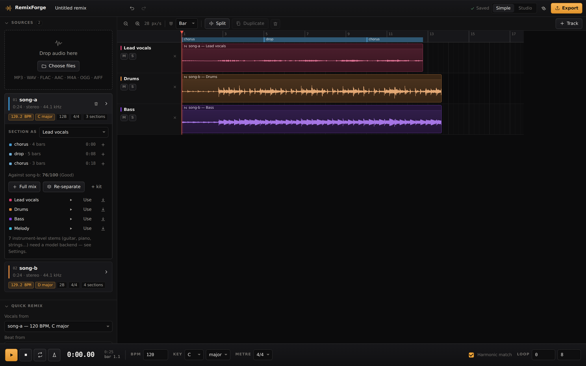

# RemixForge

An AI multi-track remix and stem studio that runs entirely in the browser. Import several songs,
split them into stems, and build a new track out of the parts — with tempo and key matching, beat
alignment, a full multitrack timeline, mixing, mastering and lossless export.

Nothing is uploaded. Decoding, analysis, separation, mixing and encoding all happen on your machine,
in Web Workers and the Web Audio API.



## The workflow

```
import songs → separate stems → detect BPM + key + structure
             → choose vocals / beat / bass / melody from different sources
             → auto-sync → arrange → mix → master → export
```

**Beginner mode** does that whole chain from three dropdowns and one button. **Advanced mode** adds
the mixer, effect racks, automation lanes and per-clip warp controls. Nothing the app decides
automatically is locked — every detected value and every automatic move is an ordinary editable
setting on the undo stack.

## Quick start

```bash
npm install
npm run dev
```

Then drop two or more audio files onto the sources panel.

| Command | What it does |
| --- | --- |
| `npm run dev` | Dev server |
| `npm run build` | Typecheck and build to `dist/` |
| `npm run lint` | oxlint |
| `npm run verify` | Codec round-trip and analysis-accuracy checks |

## What each part actually does

This matters, because "AI audio" is often a black box. Everything here is a named, inspectable
algorithm running locally.

| Stage | Method | Where |
| --- | --- | --- |
| Import | `decodeAudioData`, with in-repo WAV and AIFF decoders as fallbacks | `src/audio/import.ts` |
| Onsets | Log-compressed spectral flux, median-subtracted | `src/audio/analysis/features.ts` |
| Chroma | 8192-point STFT summed into per-semitone log-frequency bands | `src/audio/analysis/features.ts` |
| Tempo | Autocorrelation with a log-normal tempo prior and harmonic reinforcement | `src/audio/analysis/bpm.ts` |
| Beats | Ellis-style dynamic-programming beat tracker | `src/audio/analysis/bpm.ts` |
| Downbeats | Onset weight plus harmonic-change scoring over candidate phases | `src/audio/analysis/bpm.ts` |
| Key | Chroma correlated against Temperley's key profiles | `src/audio/analysis/key.ts` |
| Chords | Per-bar triad template matching | `src/audio/analysis/key.ts` |
| Structure | Self-similarity of beat-synchronous chroma + timbre, checkerboard novelty kernel | `src/audio/analysis/structure.ts` |
| Separation | Harmonic/percussive median filtering (HPSS) plus stereo centre extraction | `src/audio/separation/dspEngine.ts` |
| Time-stretch | Phase vocoder with peak locking and transient preservation | `src/audio/dsp/timestretch.ts` |
| Vocal timing | Syllable onset detection, sparse warp map, per-segment stretch | `src/audio/dsp/vocalAlign.ts` |
| Resampling | 16-tap Kaiser-windowed sinc, widened when downsampling | `src/audio/dsp/resample.ts` |
| Export | In-repo WAV and FLAC encoders; MP3 via lamejs, loaded on demand | `src/audio/dsp/`, `src/audio/export.ts` |

### Smart Vocal Align

Vocals borrowed from another song rarely sit on the new beat. Align finds syllable onsets, works out
which are slightly off the grid, and stretches the audio *between* them by a few percent so they land
on the beat.

It is deliberately not a quantiser:

- Syllables already close to the grid are left alone.
- Syllables sitting between subdivisions are treated as phrasing and left alone.
- Local speed changes are bounded — more slack over short transient-led spans, less across sustained
  notes, where warble would show.
- When a move needs more stretch than its span allows, the anchor is moved as far as the limit
  permits rather than dropped. Dropping is worse than a partial correction: an onset with no anchor
  gets dragged by whatever stretch its segment receives, which can push it *further* off the beat.

On a real separated vocal it reports what it did, e.g. *"Moved 53 syllables by 13 ms on average
(largest 38 ms). 14 left alone."* The original audio is untouched — the result is a new asset, so
undo restores the take exactly.

### Arrangement mode

Lay a song out section by section: each slot is a number of bars at the project tempo, and every part
(vocals, drums, bass, melody, instrumental) can come from a different source. The matching section of
each song is pulled in, warped to the project tempo and trimmed to the slot, so sections from songs
recorded at different tempos line up bar for bar. Transitions between different songs get a longer
crossfade automatically.

For finer control, the source panel lists each detected section with a stem picker, so you can drop
just the chorus vocal from one song and the drop from another at the playhead.

### Separation: what to expect

The built-in engine is real DSP, not a neural network. It is genuinely good at **drums, bass and
instrumental**, and reasonable at **lead vocals on a wide stereo mix** — it finds the vocal by
looking for content that is both harmonic and coherently centred between left and right.

Its honest limits:

- **Mono files**: no stereo position exists, so vocal extraction degrades to a band-limited
  harmonic estimate. The UI says so on the source card.
- **Instrument-level stems** (guitar, piano, synth, strings, brass, pads, FX) are not possible with
  this approach and are not offered. They need a trained model.
- Anything else centred and harmonic — a centred lead synth, a piano — will partly follow the vocal.

For studio-grade separation, point the app at a model backend (see below). The engine interface is
a three-method contract, so swapping in Demucs or anything else changes nothing else in the app.

## Optional model backend

Settings → Separation engine takes a base URL for a separation service you run yourself. Two
endpoints, documented with a working ~40-line Demucs wrapper in
[`docs/model-backend.md`](docs/model-backend.md).

**Audio is uploaded to whatever address you enter**, so only point it at a server you control. With
no URL configured, nothing ever leaves the browser.

## Verification

Audio code fails quietly, so the parts that can be checked are checked:

```
$ npm run verify

PASS  flac 16-bit 5000 samples   maxErr=1.53e-5 size=71.6% of raw
PASS  flac 24-bit 12000 samples  maxErr=5.96e-8 size=80.0% of raw
PASS  wav 16/24/32-bit
PASS  aiff 16-bit
PASS  key detection over all 24 keys        24/24
PASS  tempo detection across 90–174 BPM     7/7
PASS  beat grid at 120 BPM                  40 beats, mean interval 0.500s
PASS  structure finds section boundaries
PASS  plan moves most off-grid syllables    moved 17, mean shift 28ms
PASS  syllables land closer to the beat     30.4ms → 8.1ms
PASS  no clicks at segment joins
PASS  already-aligned material is left alone
PASS  material between subdivisions is not force-quantised
```

The FLAC encoder is checked against libFLAC compiled to WASM, not against itself. The alignment
checks re-detect onsets in the *rendered* audio rather than inspecting the plan, so they measure
what actually came out.

Three real bugs these caught:

- Chroma computed from the 2048-point onset FFT cannot resolve semitones below ~500 Hz. Key
  detection was wrong on **17 of 24 keys** until chroma got its own high-resolution pass.
- Overlap-add normalisation divided by the summed squared window, which tends to zero at signal
  edges — amplifying the first samples of every stretched segment by ~1000×.
- Alignment anchors that exceeded the local rate limit were dropped, which left those syllables to
  be dragged *backwards* by the surrounding stretch. Clamping instead of dropping took the measured
  error from 26 ms down to 8 ms.

## Architecture

```
src/
  audio/
    analysis/     tempo, key, chords, structure, shared features
    dsp/          FFT, STFT, HPSS, phase vocoder, resampler, WAV/FLAC/AIFF codecs
    effects/      effect definitions, Web Audio rack builder, AudioWorklets, mastering presets
    separation/   engine contract, built-in DSP engine, remote model engine
    workers/      analysis / separation / warp workers and their typed protocol
    engine.ts     the live AudioContext, transport, scheduling, automation, metering
    render.ts     offline render for export
  remix/          sync, alignment, compatibility scoring, arrangement, Smart Remix, AI mix
  assistant/      natural-language instruction parser
  state/          project model, store with undo/redo, IndexedDB persistence
  ui/             React components
```

Two invariants hold the design together:

1. **Audio samples never live in the project.** The project is plain serialisable JSON that refers
   to assets by id; decoded audio lives in a separate store. That is what makes editing
   non-destructive and saving cheap — an edit rewrites instructions, never samples.
2. **Everything automatic is an ordinary edit.** AI Mix, Quick Remix, Smart Remix and the assistant
   all go through the same store actions as hand edits, so each one is undoable, inspectable and
   overridable.

### Non-destructive editing and history

Original files are never modified. Clips store instructions — source, offset, length, gain, fades,
pitch, stretch — and the engine applies them at playback and render time. Undo and redo hold up to
1000 steps, and versions snapshot a stem combination so you can A/B two arrangements instantly
without duplicating any audio.

### Live preview vs quality render

Changing a clip's tempo or pitch is audible immediately: playback falls back to varispeed while a
phase-vocoder render runs in a worker, then switches to the high-quality version when it is ready.
Export always waits for the rendered version — it never ships varispeed.

## Known limitations

- Vocal separation quality is bounded by the DSP approach; see above.
- Section labels (`verse`, `chorus`, `drop`…) are heuristics over repetition, energy and position.
  They are right on conventional song shapes and can be wrong on anything unusual. All of them are
  editable.
- Key detection assumes a single key for the whole track; modulations are reported as one key with
  a runner-up.
- Long projects hold all decoded stems in memory. The Settings panel shows current usage, and
  separation targets are chosen per source so you only pay for stems you asked for.
- The assistant is a rule-based parser, not a language model. It runs offline and is predictable,
  but it only understands the instruction shapes listed in its suggestions.
- Smart Vocal Align depends on syllable onsets being visible in the stem. It works well on a clean
  separated vocal and poorly on one with heavy instrumental bleed, since the bleed's transients look
  like syllables.

## Rights and permitted use

Only import and remix audio you own, created yourself, have permission to remix, or are otherwise
legally permitted to use.

RemixForge deliberately contains no tools for downloading music, bypassing copy protection or DRM,
circumventing streaming-service protections, or imitating a specific artist's voice. Separating and
rearranging a file you already hold is your responsibility to clear.

## Licence

MIT — see [LICENSE](LICENSE).
